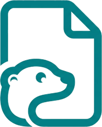
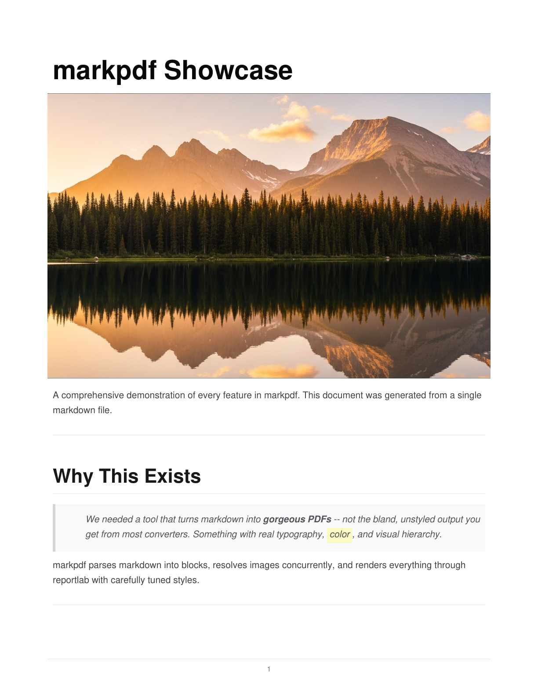
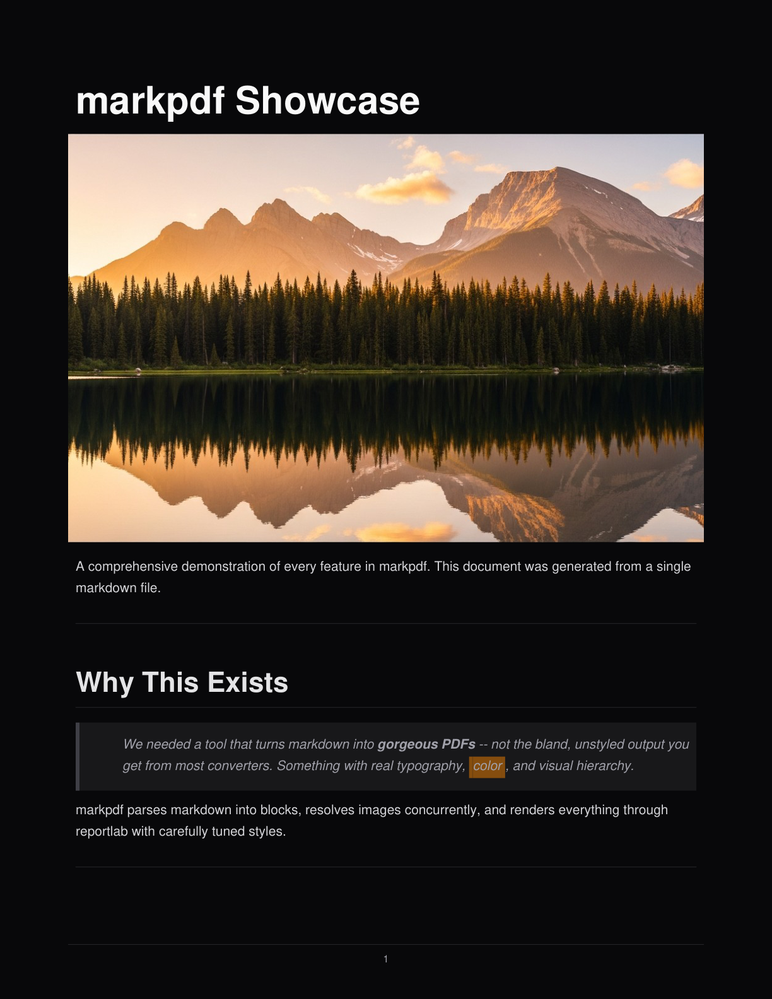
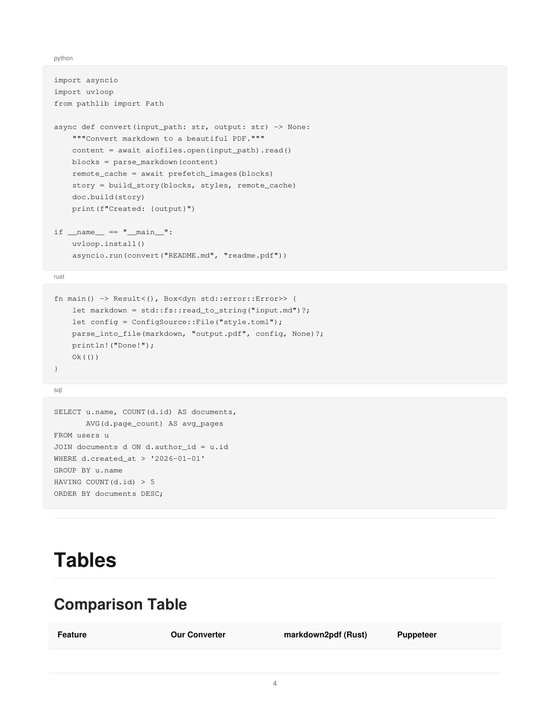
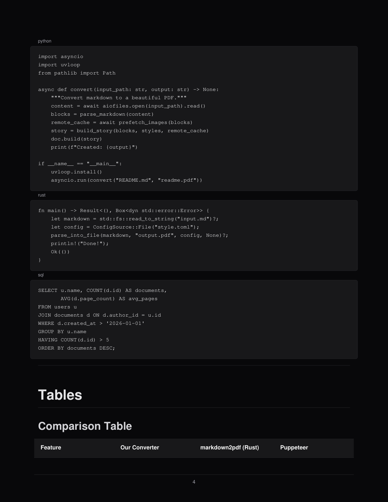

<p align="center">
  
</p>

<h1 align="center">markpdf</h1>

<p align="center">
  Beautiful PDFs from markdown. One command, zero config.
</p>

<p align="center">
  <a href="https://github.com/araa47/markpdf/actions"></a>
  <a href="https://pypi.org/project/markpdf"></a>
  <a href="https://github.com/araa47/markpdf/blob/main/LICENSE"></a>
  <a href="https://pypi.org/project/markpdf"></a>
</p>

---

```bash
markpdf report.md
```

## Install

**Agent skill** (Claude Code, Cursor, Codex, Gemini CLI):

```bash
npx skills add araa47/markpdf
```

**CLI**:

```bash
uv tool install git+https://github.com/araa47/markpdf
```

Or with pip:

```bash
pip install markpdf
```

## Usage

```bash
markpdf report.md                        # creates report.pdf
markpdf report.md --dark                  # dark mode
markpdf report.md -o final.pdf            # custom output path
markpdf report.md -k                      # keep sections on same page
markpdf report.md -v                      # verbose output
```

## Output

<table>
<tr>
<td><strong>Light</strong></td>
<td><strong>Dark</strong></td>
</tr>
<tr>
<td></td>
<td></td>
</tr>
<tr>
<td></td>
<td></td>
</tr>
</table>

> Source: [`tests/fixtures/showcase.md`](tests/fixtures/showcase.md) | Full PDFs: [`examples/`](examples/)

## Features

- **Full markdown** -- headers, lists, tables, code blocks, blockquotes, images, task lists
- **Extended syntax** -- `==highlight==`, `^super^`, `~sub~`, `~~strike~~`
- **Light & dark themes** -- shadcn/ui zinc palette
- **Smart page breaks** -- headings stay with their content, no orphans
- **Remote images** fetched concurrently
- **Async I/O** with optional uvloop
- **Single command**, agent-friendly -- no browser, no LaTeX, no config

## Why markpdf?

Most messaging apps (Slack, Discord, Teams, WhatsApp, email) don't render markdown. `markpdf` turns it into a polished PDF -- no browser, no LaTeX, no config.

## Contributing

See [CONTRIBUTING.md](CONTRIBUTING.md) for development setup.

```bash
uv sync --all-extras --dev
uv run pytest
```

## Changelog

See [CHANGELOG.md](CHANGELOG.md) for release history.

## License

[MIT](LICENSE)
